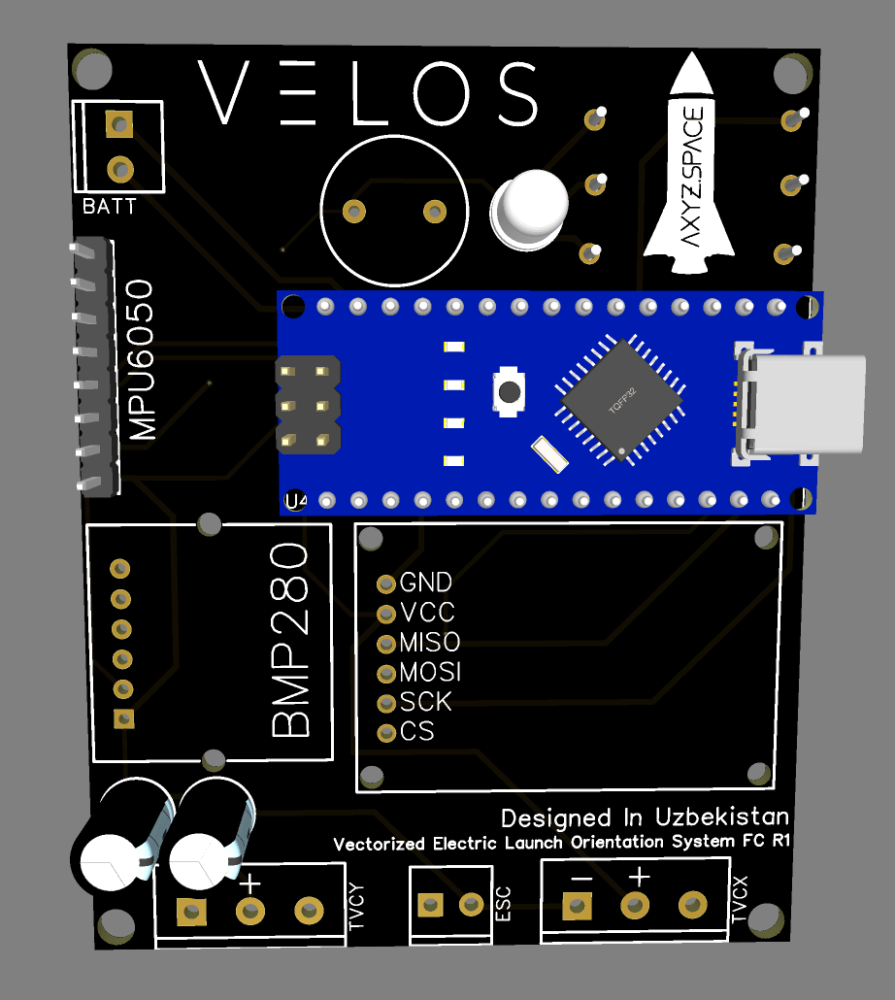

# VELOS-R1 Schematics and Flight Software

  
  

## About VELOS-R1
**VELOS-R1** is a flight computer built for Thrust-Vector-Controlled (TVC) rockets.  
This repository includes the PCB and EasyEDA schematics for hobbyists and pioneers who want to start their TVC journey.  

The flight software is under active development and currently provides an example framework.  

Contributions and improvements are welcome!

## How to Use the PCB and Schematics
1. Fork this repository.  
2. Install [EasyEDA](https://easyeda.com/) if not installed already.  
3. Open the `.json` files in the `EasyEDA Schematics` folder.  
