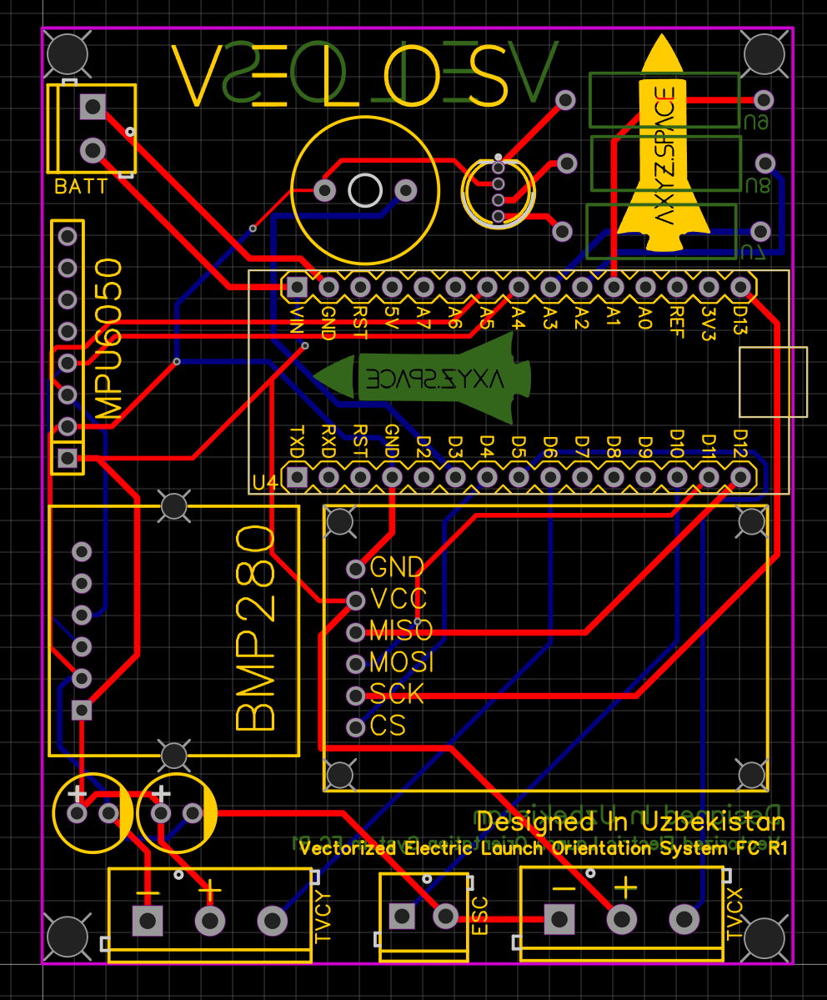

# 🚀 VELOS-R1 Flight Computer

## About VELOS-R1
VELOS-R1 is a flight computer built for **Thrust-Vector-Controlled (TVC) rockets**.  
This repository includes the **PCB Gerber files** and **EasyEDA schematics** for hobbyists and pioneers who want to start their TVC journey.  

The flight software is under **active development** and currently provides a framework for basic TVC control.  

Contributions and improvements are welcome!  

---

## Release v1.0.0

### Overview
This is the **first official release (v1.0.0)** of the VELOS Flight Computer project.  
It includes the **initial hardware design (Gerber files)** and **firmware/software** required to get started. The system is still under **active development**, so expect updates and improvements in future versions.  

### What's Included
#### Hardware
- Gerber files for PCB fabrication  
- Schematic files (reference for assembly & debugging)  

#### Software
- Arduino-based firmware for the VELOS Flight Computer  
- Support for MPU6050 IMU sensor integration  
- Basic control logic for 2-axis thrust vector control (TVC) via servo motors  
- Data logging support (early version, subject to changes)  

### Known Limitations
- Limited testing performed on prototype hardware  
- Basic stabilization only (no advanced filtering or PID tuning yet)  
- Data logging and telemetry features are minimal/incomplete  
- Hardware not yet optimized for manufacturability or mass production  

### Next Steps (Planned for Future Releases)
- Improved flight algorithms (PID tuning, sensor fusion, filtering)  
- Expanded data logging & telemetry features  
- Hardware revisions for durability and performance  
- Documentation updates & example usage guides  

### Disclaimer
⚠️ This release is **for development, testing, and educational purposes only**.  
Not flight-proven. Use at your own risk.  

---

## How to Use the PCB and Schematics
1. Fork this repository.  
2. Install [EasyEDA](https://easyeda.com/) if not installed already.  
3. Open the `.json` files in the **EasyEDA Schematics** folder.  
